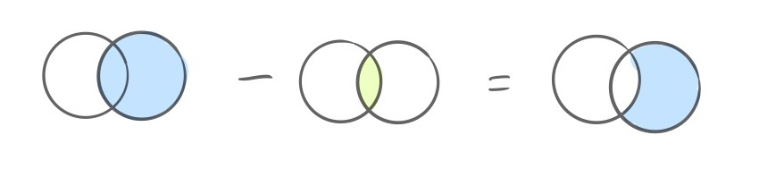

# JOIN 프로그래머스 문제 풀이

# 💡없어진 기록 찾기

    SELECT b.animal_id, b.name
    FROM animal_ins a RIGHT JOIN animal_outs b ON a.animal_id = b.animal_id
    WHERE a.animal_id is null
    ORDER BY b.animal_id

