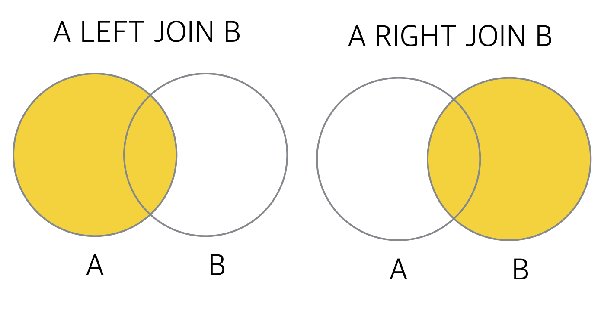

# JOIN

# JOIN

두개 이상의 테이블에 대해서 결합하여 나타낼때 

## Inner Join

두 테이블의 교집합

두 테이블의 컬럼 정보가 같은 것만 보여줌 

    SELECT table1.co1, table2.co1 
    FROM table1 [table1의 별칭]
    JOIN table2 [table2의 별칭] ON table1.co1 = table2.col2 

### Ex

    SELECT a.id, b.name
    FROM animal_in a 
    JOIN animal_out b ON a.id = b.id 

## Left Join

    SELECT gg._id, gg.name, s.title 
    FROM girl_group AS gg 
    LEFT OUTER JOIN song AS s ON s._id = gg.hit_song_id; 

## Right Join

    SELECT s._id, s.title, gg.name 
    FROM girl_group AS gg 
    RIGHT OUTER JOIN song AS s ON s._id = gg.hit_song_id;

출처 : [https://futurists.tistory.com/17](https://futurists.tistory.com/17)